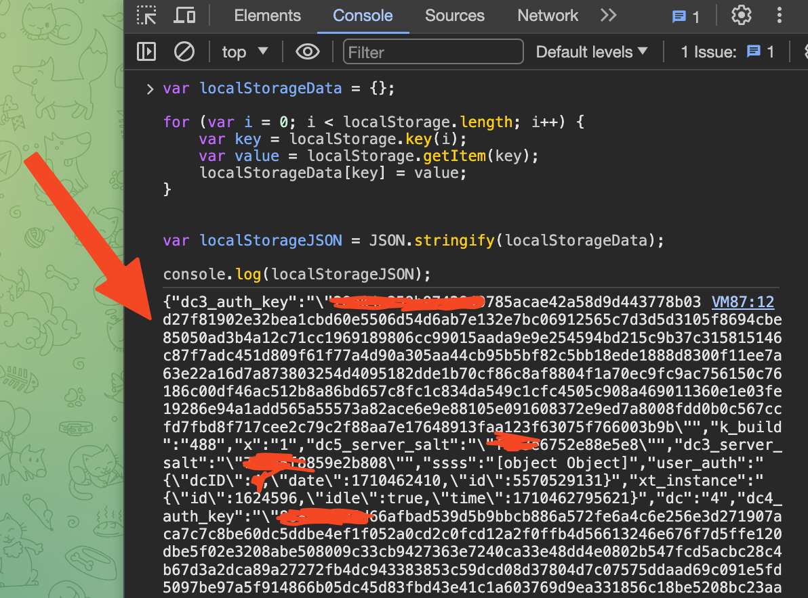

## How to run ? 
1. open `.env` in this project and add 
    ```.environment 
    apiId=
    apiHash=
    ```
 2. Add your telegram web session to `sessions.json`
 3. run `python3 telegram_ops.py` :D

___
## if the session expires
>  1. login to web.telegram.com 
___
> 2. Inspect the page and go to console tab and paste this to grab session information
```javascript
var localStorageData = {};

for (var i = 0; i < localStorage.length; i++) {
    var key = localStorage.key(i);
    var value = localStorage.getItem(key);
    localStorageData[key] = value;
}


var localStorageJSON = JSON.stringify(localStorageData);

console.log(localStorageJSON);
```
___ 
> 3. copy the values to `sessions.json`
example:



____

> Other than that you can decrease the the waiting time in `verifier.py` but it may be unnecessary